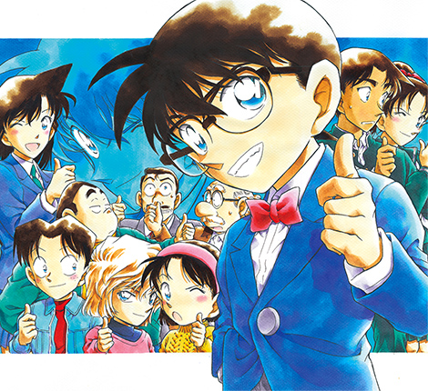

<!--
_backgroundColor: black
_color: white
_footer: 'Photo by Benjamin Rascoe on Unsplash'
-->

# タイトル全面背景

Brightnessを落とし、文字の視認性を上げました

---
<!--
_backgroundColor: orange
paginate: true
_footer: 'Photo by Michal Vasko　on Unsplash'
-->

### 左に画像をいれる

- 表示場所、比率を指定する
- 次頁では、複数画像を並べます
- footerで画像クレジット表示も

---
<!--
_backgroundColor: white
_footer: 'Photo by Chris Campbell, Dan on Unsplash'
-->

# バーロ
#### 真実はいつも
## 一つ!
#### だろ

by Shiniti Kudou

--- 